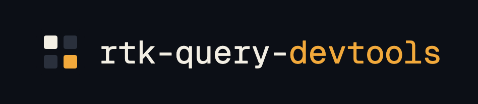
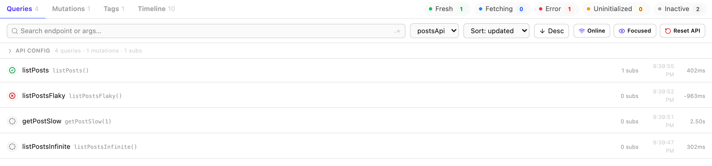

<div align="center">



**A [TanStack DevTools](https://tanstack.com/devtools) plugin for RTK Query.**<br>
Inspect cache entries, mutations, tags, and requests in real time.

[](https://www.npmjs.com/package/rtk-query-devtools)
[](https://github.com/ryck/rtk-query-devtools/actions/workflows/ci.yml)
[](LICENSE)

[**Live playground**](https://rtk-query-devtools.ryck.dev/playground) ·
[**Features**](https://rtk-query-devtools.ryck.dev/features) ·
[**Package docs**](packages/core/README.md)

</div>

<picture>
  <source media="(prefers-color-scheme: dark)" srcset="apps/web/public/features/dark/queries-list.png">
  
</picture>

## Why

RTK Query's only debugging surface today is the Redux DevTools action log, where cache
activity is buried alongside every other reducer. You can read `state[reducerPath]` as a raw
JSON blob, but there is no query-centric view, no status at a glance, and no way to trigger a
refetch or invalidate a tag.

This gives it a dedicated panel: derived status per cache entry, a tag and invalidation
explorer, a request timeline with per-endpoint timings, and cache actions you can fire while
you debug.

## Quick start

```bash
pnpm add -D rtk-query-devtools @tanstack/react-devtools
```

```ts
// store.ts
import { configureStore } from "@reduxjs/toolkit"
import { createRtkQueryDevtools } from "rtk-query-devtools"
import { api } from "./api"

export const rtkqDevtools = createRtkQueryDevtools({ apis: [api] })

export const store = configureStore({
  reducer: { [api.reducerPath]: api.reducer },
  middleware: (getDefaultMiddleware) =>
    getDefaultMiddleware().concat(api.middleware, rtkqDevtools.middleware),
})
```

```tsx
// App.tsx
import { TanStackDevtools } from "@tanstack/react-devtools"
import { createRtkQueryDevtoolsPlugin } from "rtk-query-devtools"

export function App() {
  return (
    <>
      <YourApp />
      <TanStackDevtools plugins={[createRtkQueryDevtoolsPlugin()]} />
    </>
  )
}
```

No stylesheet import, and both pieces become no-ops in production builds, so they are safe to
leave in place. See **[packages/core/README.md](packages/core/README.md)** for the full API,
what each tab does, and compatibility.

## Repository

A pnpm workspace, orchestrated with [Turborepo](https://turbo.build/).

| Path                | What it is                                                                       |
| ------------------- | -------------------------------------------------------------------------------- |
| `packages/core`     | The published `rtk-query-devtools` package: middleware, selectors, and the panel |
| `packages/demo-api` | An in-memory fake backend, shared so both demos hit identical data and timing    |
| `apps/demo`         | Minimal Vite app the Playwright suite drives                                     |
| `apps/web`          | The marketing site and live playground at `rtk-query-devtools.ryck.dev`          |

`apps/web` runs the panel next to TanStack Query's own devtools against the same fake API,
which makes the two directly comparable.

## Development

Requires Node `>=24` and pnpm `>=11`. (The published package itself only needs Node `>=20`.)

```bash
pnpm install
pnpm dev:demo   # the demo app the e2e suite uses
pnpm dev:web    # the site and playground
```

`pnpm dev` runs `packages/core` in watch mode, for working on the panel with either app
running alongside it.

### Checks

```bash
pnpm lint        # oxlint
pnpm format      # oxfmt
pnpm typecheck   # builds dependencies first, then tsc
pnpm test        # unit tests (Vitest), watch mode
pnpm test:ci     # unit tests, single run
pnpm test:e2e    # Playwright, against apps/demo
```

> [!IMPORTANT]
> `pnpm test:e2e` runs against the **built** `packages/core`, so run `pnpm build` first (or
> `pnpm typecheck`, which builds as a side effect). Without it the demo resolves a stale
> `dist` and new panel behaviour looks like it is simply missing.

Unit tests deliberately run against a real store built with `configureStore` and `createApi`
rather than hand-written state fixtures, because the internal RTK Query action types this
package depends on are its main version-coupling risk, and only a real store catches a rename.

### Screenshots

The images on `/features` are captured from the real panel, never mocked up, in both themes:

```bash
pnpm dev:demo                        # in one terminal
pnpm --filter web run feature-shots  # in another
```

## Releasing

Handled by [changesets](https://github.com/changesets/changesets). Add one describing your
change:

```bash
pnpm changeset
```

Merging to `main` opens a release PR that applies the version bump and changelog. Merging
_that_ publishes to npm. Versions are never edited by hand.

## License

[MIT](LICENSE)
